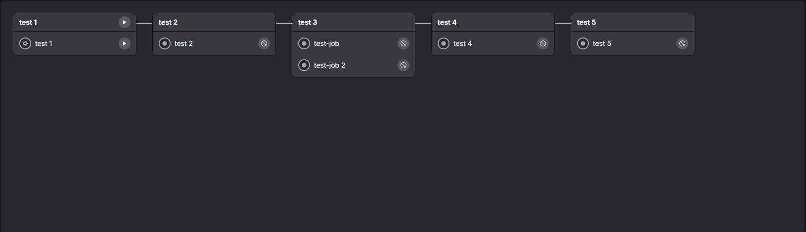
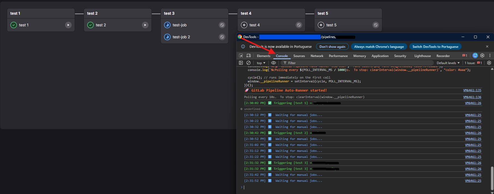
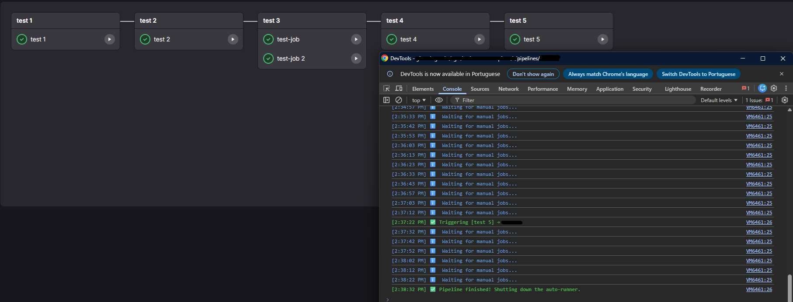

# GitLab Pipeline Auto-Runner

A lightweight browser script that automatically triggers all manual jobs in a GitLab pipeline — no CLI tools, no tokens, no setup required.

## How it works

Paste the script directly into the **DevTools Console** (F12) while on a GitLab pipeline page. It will poll the page every 10 seconds and click any available **Run** button on manual jobs as soon as they appear, advancing the pipeline without any manual intervention.

## Usage

1. Open your GitLab pipeline page.
2. Open **DevTools** → **Console** (F12 or Ctrl+Shift+I).
3. Paste the entire contents of `gitlab_pipeline_runner.js` and press **Enter**.
4. The runner starts immediately and logs each action to the console.

**To stop it at any time:**
```js
clearInterval(window.__pipelineRunner)
```

**To change the polling interval** (default: 10 seconds), edit `POLL_INTERVAL_MS` at the top of the script before pasting:
```js
const POLL_INTERVAL_MS = 10000; // polling interval in ms
```

## Demo

### 1. Initial pipeline state — manual jobs waiting to be triggered



The pipeline has started, but one or more stages contain manual jobs (shown with a play button). Without the script, each one would need to be clicked individually.

---

### 2. Jobs running after pasting the script in DevTools → Console



Once the script is pasted, it detects all available **Run** buttons and clicks them automatically. Jobs transition to the running state without any user interaction.

---

### 3. Jobs completed — pipeline finished



When all jobs reach a terminal state (passed, failed, canceled, or skipped), the runner detects the end of the pipeline, logs a completion message, and stops itself automatically.

---

## Notes

- Works entirely in the browser — no extensions, tokens, or API calls needed.
- Safe to re-paste: already-triggered jobs are tracked in memory and won't be double-clicked.
- The runner stops automatically when the pipeline finishes, or can be stopped manually at any time.
- Tested on GitLab's current pipeline UI (`data-testid` selectors). If GitLab updates its markup, the selectors may need adjustment.
